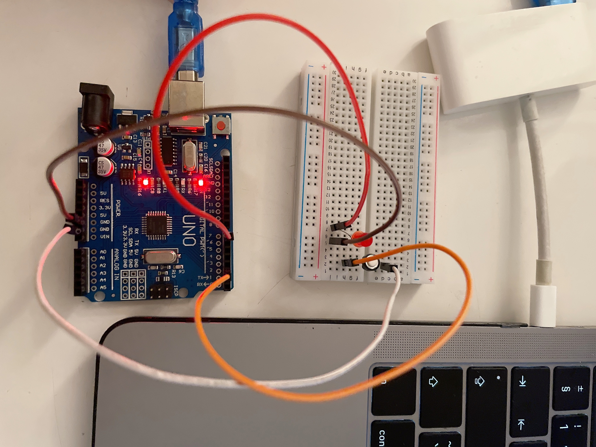

# Controlling LED using Push Button

Welcome to the **Controlling LED using Push Button** project repository. This project demonstrates a basic electronics application where a push button is used to control an LED connected to a microcontroller.

## Table of Contents

- [Files Included](#files-included)
- [Setup](#setup)
- [Getting Started](#getting-started)
- [Conclusion](#conclusion)

## Files Included

### 1. LED_with_PushButton.ino

This file contains the Arduino code used to control the LED with a push button. It manages the interaction between the push button and LED states.

### 2. LEDwPushButtonCode.png

This circuit diagram illustrates how to correctly wire the push button and LED to your microcontroller. Verify your connections against this diagram before proceeding.

### 3. PushButton-w-LED.MOV

This MOV file is a visual demonstration of the project in action. Click the link below to watch the demo:

[Watch Demo Video](https://github.com/shathalshehri/Controlling-LED-using-Push-button/blob/main/PushButton-w-LED.MOV)

### 4. SetUp.JPG

This image shows the physica
