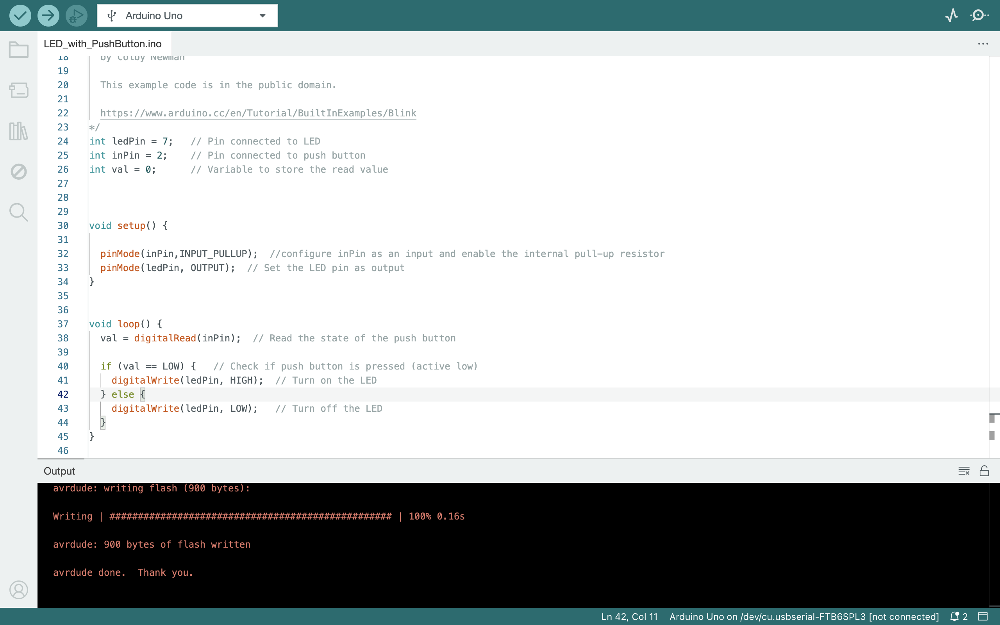

# Controlling LED using Push Button

Welcome to the **Controlling LED using Push Button** project repository. This project demonstrates a fundamental electronics application where a push button is used to control an LED connected to a microcontroller.

## Files in the Repository

### LED_with_PushButton.ino

This file contains the Arduino code used to control the LED with a push button. Ensure to upload this code to your microcontroller.

### LEDwPushButtonCode.png

This PNG file provides a comprehensive circuit diagram detailing the connections for the LED and push button setup. Verify your connections against this diagram before proceeding.

### PushButton-w-LED.MOV

This MOV file is a demonstration video showcasing the functionality of the project. It illustrates how pressing the push button toggles the LED state.

To view the demonstration, download and play the "PushButton-w-LED.MOV" file on your device.

## Getting Started

1. **Setup**: Connect the components as shown in the circuit diagram (`LEDwPushButtonCode.png`).

2. **Code Upload**: Upload the provided Arduino code (`LED_with_PushButton.ino`) to your microcontroller.

3. **Watch the Demo**: Download and view the video (`PushButton-w-LED.MOV`) to observe the project in action.

By following these steps, you will successfully implement and experience controlling an LED using a push button with your microcontroller setup. Enjoy exploring and learning through this practical electronics project!

